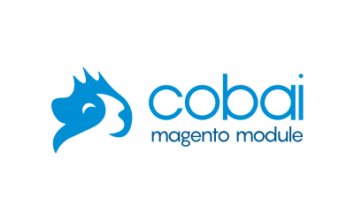

<h1 align="center">Welcome to COBAI - Magento module 👋</h1>
<p align="center">
    
    
    
    
</p>

<p align="center">
  
</p>

## 🐹 What is COBAI Magento module?
`COBAI Magento module` helps you to transfer your CMS blocks, pages, images, and hierarchies from a platform to another platform.

When you run the export command line, `COBAI Magento module` creates a package with all your CMS data in your `var/export` directory. After that, you just need to transfer your archive to the other platform in the `var/import` directory. Then, run the import command line.

:warning: Don't forget to clean your `var/export` and `var/import` directories. Indeed, the import does not delete the imported files so that you can reuse them if you need it.

### Why COBAI? 
Because `COBAI` is the abbreviation of `COntent Backup And Import` *- we wanted to have a funny and cute logo -*.

### Compatibility  
`COBAI Magento module` is compatible with Magento **2.3.x** CE and EE versions. If you work with Magento EE version, it keeps your layouts configurations with the PageBuilder. 

## 🛠 Getting Started
### Install
You can install the module with Composer.
```
$ composer require emakinafr/magento2-cobai
$ php bin/magento setup:upgrade
```

### Usage
To export an archive with pages, blocks, images and hierarchies, you need to run:
```
$ bin/magento cobai:cms:export
```

To import an archive, you need to run:
```
$ bin/magento cobai:cms:import <path/of/your/filename.ext>
```

To clean your working directory, you need to run:
```
$ rm -rf var/export var/import
```

## 🚀 Advanced Features
### Export Options
```
$ bin/magento cobai:cms:export --type [typeOption]
```

| Type Option 	        | Description                  	   | 
|-------------------    |------------------------------	   |
| archive       	    | export archive to zip file   	   |
| block          	    | export blocks to csv file        | 
| image         	    | export images to zip file    	   |  
| hierarchy     	    | export hierarchies to csv file   | 
| page          	    | export pages to csv file     	   | 

If you want to customize the name of your file you can use `--file=[name]`. You need to specify the path of this file, for example: `var/export/archive.zip`.

### Import Options
```
$ bin/magento cobai:cms:import --type [typeOption] <path/of/your/filename.ext>
```

| Type Option 	        | Description                  	   | 
|-------------------    |------------------------------	   |
| archive       	    | import archive to zip file   	   |
| block          	    | import blocks to csv file        | 
| image         	    | import images to zip file    	   |  
| hierarchy    	        | import hierarchies to csv file   | 
| page          	    | import pages to csv file     	   | 

### Warning
- By default, the option only adds changes except for the **hierarchy and image option** which systematically **replaces all data**.  
- For blocks/pages, you can use `--force`, to update old blocks/pages.
